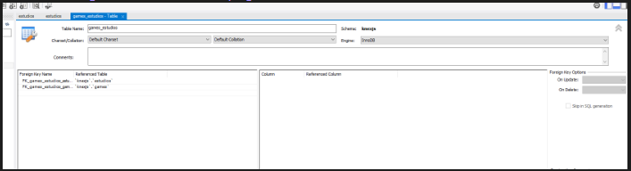

## Configurando Node
```
npm init -y // tira as questoes iniciais que ele pergunta !
```
## Baixando KNEX
```
npm install knex --save
```
## Baixando o banco de dados escolhido
- Mysql 2 é mais recente !
```
npm install mysql2
```

## Arquivos
### database.js
- Criacao do arquivo que há a configuracao dos dados da database
### index.js 
- Arquivo de exemplo utilizado para fazer as alteracoes no banco de dados 


## Insert
```
var database = require("./database.js");

  

var dados = [

  {

    nome: "call of duty 2",

    preco: 60.5,

  },

  {

    nome: "GTA",

    preco: 60.5,

  },

  {

    nome: "CS2",

    preco: 97,

  },

];

  

var query = database

  .insert(dados)

  .into("games")

  .then((data) => {

    console.log(data);

  })

  .catch((err) => {

    console.log(err);

  });
```
- Nesse exemplo coloquei junto com JSON para ficar mais intuitivo o aprendizado !

## Select
```
database.select("id","preco").table("games").then(data => {

    console.log(data)

}).catch(err => {

    console.log(err)

})
```
- No primeiro select, temos as colunas que desejamos identificar !
## Nested Queries
- Possibilidade de executar de uma vez os dados, tem que ser utilizado com Async / Await !
```
database

  .insert({ nome: "Mists of noyah", preco: 25 })

  .into("games")

  .then((data) => {

    database

      .select("id", "preco")

      .table("games")

      .then((data) => {

        console.log(data);

      })

      .catch((err) => {

        console.log(err);

      });

  })

  .catch((err) => {

    console.log(err);

  });
```
## Where
- Pode ser utilizado com 2 where, significando 'and'
- se quiser fazer or
```
var query = database

  .orWhere({id:2})

  .where({ nome: "Mists of noyah" })

  .table("games");
```
- Condicao sera com where puro
```
var query = database

  .whereRaw("preco > 50")

  .where({ nome: "Mists of noyah" })

  .table("games");

  

console.log(query.toQuery());
```

```
database

  .select()

  .whereRaw("nome = 'Mists of Noyah' OR preco > 120")

  .table("games")

  .then((data) => {

    console.log(data);

  })

  .catch((err) => {

    console.log(err);

  });
```

```
  

var database = require("../database.js");

  

database.raw("select * FROM games").then(data=> {

  console.log(data)

}).catch(err => {

  console.log(err)

})
```
- Possibilidade de usar raw
## Delete
- Vai retornar no console a qtd de registros deletados
```
database

  .where({

    id: 3,

  })

  .delete()

  .table("games")

  .then((data) => {

    console.log(data);

  })

  .catch((err) => {

    console.log(err);

  });
```
## Update
- Vai atualizar um valor pre-existente
```
database.where({id: 5}).update({preco:40}).table("games").then(data =>{

  console.log(data)

}).catch(err =>{

  console.log(err)

})
```
## Order by
- Vai organizar a saida pra alguma ordem que eu definir, geralmente coloca-se valor ou nome
```
database.select().table("games").orderBy("nome","desc").then(data => {

  console.log(data)

}).catch(err => {

  console.log(err)

})
```
## Montando tabela 1 para 1 
```
//relacionamentos

// 1 p 1

// 1 p M (muitos)

// M P M (muitos para muitos)

  

// JOIN (Pegar dados de tabelas diferentes, utilizando um join)
```
- Foi feito no MySQL
## Inserts associados
- Passar os campos que tem na tabela e que nao sao usurpadas da outra.
- Nesse exemplo, precisou colocar o nome do estudio e relacionar com o ID do jogo que o "estudio fez"
```
database.insert({

  nome: "Blizzard",

  game_id: "5"

}).table("estudios").then(data => {

  console.log(data)

}).catch(err =>{

  console.log(err)

})
```

## Join
- Utilizacao do as para transformar colunas com mesmo nome de diferente tabelas para nomes distintos
- Usar *  para pegar todas as colunas desejadas de uma tabela, sem ter que escrever todas
```
database.select(["games.id","estudios.id as estudio_id", "games.nome as game_nome", "estudios.nome as estudio.nome"]).table("games").innerJoin("estudios", "estudios.game_id", "games.id").then(data =>{

  console.log(data)

}).catch(err =>{

  console.log(err)

})
```

```
database.select(["games.*", "estudios.nome as estudio_nome"]).table("games").innerJoin("estudios", "estudios.game_id", "games.id").then(data =>{

  console.log(data)

}).catch(err =>{

  console.log(err)

})
```
## Join Where
- Serve pra geralmente especificar o elemento que deseja buscar
- Utilizado no final do join por facilidade
```
database.select(["games.*", "estudios.nome as estudio_nome"]).table("games").innerJoin("estudios", "estudios.game_id", "games.id").where("games.id",5).then(data =>{

  console.log(data)

}).catch(err =>{

  console.log(err)

})
```

## Relacionamento 1 para M
- Segue a mesma logica do 1 para 1
- Nesse exemplo temos um tratamento dos dados, para pegar o id, nome e percorrer uma lista dos estudios envolvidos !
```
var database = require("../database.js");

  

database.select(["games.*", "estudios.nome as estudio_nome"]).table("games").innerJoin("estudios", "estudios.game_id", "games.id").then(data =>{

  var estudiosGamesArray = data

  var game = {

    id: 0,

    nome: "",

    estudios: []

  }

  game.id = data[0].id

  game.nome = data[0].nome

  

  data.forEach(estudio => {

    game.estudios.push({nome: estudio.estudio_nome})

  })

  

  console.log(game)

}).catch(err =>{

  console.log(err)

})
```

## Modelando Tabela M para M
- Precisa de ao menos uma tabela intermediaria, no caso 3 tabelas !
- Criar 2 ou +  chaves estrangeiras que conectam com essa tabela de conjunto, colocar em cascade pra quando sair de uma sair das outras tbm !
